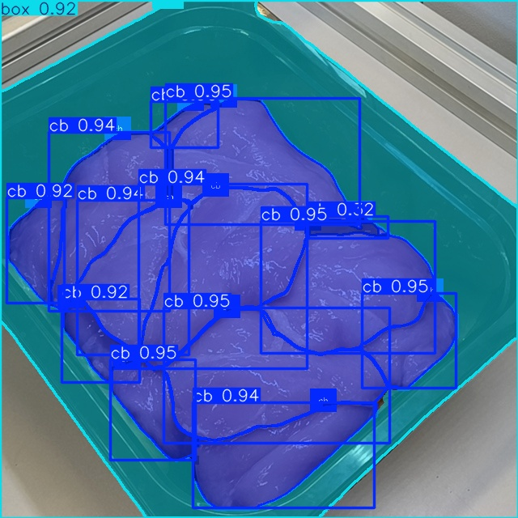

# yolov8 <sup><sup><sub>(by Henry)</sub></sup></sup>

Preliminary:
- Install Segment Anything:
```
pip install git+https://github.com/facebookresearch/segment-anything.git
```
- Install OpenCV, Numpy, Imutils:
```
pip install opencv-python imutils numpy
```
- *Optional*:
```
mkdir ./pretrained_model
mkdir ./datasets
mkdir ./test_images
```

## masking.py
Making YOLOv8 annotations with Grabcut and SAM.\
Create a UI with 4 screens:
- Screen 0 for original image and interactions for Grabcut
- Screen 1 for SAM-ed image with contours
- Screen 2 for merging contours from SAM and Grabcut to form an instance contour
- Screen 3 for multiple instance contours (blue) and box contour (yellow)


Interfaces:
- Middle click Screen 0: place Grabcut marks
- Left click Screen 1: select SAM contours
- Right click Screen 1 (not developed): select SAM contours as exclusive
- Left click Screen 2: select merged contours as instance contour
- Right click Screen 2: remove merged contours
- Middle click Screen 2: select merged contours as box contour
- Right click Screen 3: remove instance/box contours
- Middle click Screen 3: make annotations from selected contours and move to next image

How to run:
- Download [ViT-H SAM model](https://dl.fbaipublicfiles.com/segment_anything/sam_vit_h_4b8939.pth).
- Check `original_path` and `new_anno_path`.
- Check `start` in `app.run(start=0)` if continue from some images.
- Run.

Limitations:
- Only one type of instance and one box
- Not highly configured SAM

## masking_v2.py
Making YOLOv8 annotations from Colored Labels.

How to run:
- Check `root_path`, `original_path`, `anno_path`, `new_image_path`, `new_mask_path`, and `new_anno_path`.
- Check `visualize` in `App(visualize=True)` if visualization is needed.
- Check color codes in `LABELS`.
- Run.

Limitations:
- Need to change nested loops in main loop if datasets have different structures (preliminary for oranges).

## index_divide_set.py index_divide_set_v2.py
Both scripts can be used to shuffle the datasets output from `masking.py` to organized directories used in YOLO.
The difference between these versions are:
- `index_divide_set.py` iterates through all images and ignores any images if its annotation is not found.
Therefore, the number of images and annotations are equal.
- `index_divide_set_v2.py` also iterates through all images and the image is independent on the annotation.
Therefore, the number of images is higher, as the ones without annotations are considered as background images.

How to run:
- Check `original_paths` and `annotation_paths`. Multiple datasets (pair of image and annotation folders) can be input at once.
- C[best.pt](runs%2Fsegment%2Ftrain46%2Fweights%2Fbest.pt)heck `dest_path` for output dataset.
- Check `ratio` for the **train/test/validate** dataset ratio.
- Run.

## train.py
Basic script for YOLO model training. \
Can be updated with new YOLOv11.\

How to run:
- Select a model to train, e.g., `yolov8n-seg.yaml` (nano) or load a pretrained model, e.g., `pretrained_model/best_crawled.pt`.  
Check [YOLOv8 Instance Segmentation](https://docs.ultralytics.com/tasks/segment/).
- Create YAML file, e.g., `cb.yaml` and check `path` and `names`.
- Set `model.resume = True` if continue with a pretrained model.
- Check export format `model.export()`, as `.pt` is set by default.
- Run.

Limitations:
- Not really investigated in training configuration, e.g., augmentation or batch size.

## test.py
Basic script for YOLO model testing. \
The trained model can be found in `./runs/segment/train$$/weights/`. \
It is best to copy `best.pt` to `./pretrained_model/`.

How to run:
- Select a model to load, e.g., `./pretrained_model/best_crawled_raw.pt`.
- Check input image, e.g., `./test_images/000114.jpg`.
- Run.



Limitations:
- Not really investigated in `Annotator`.
